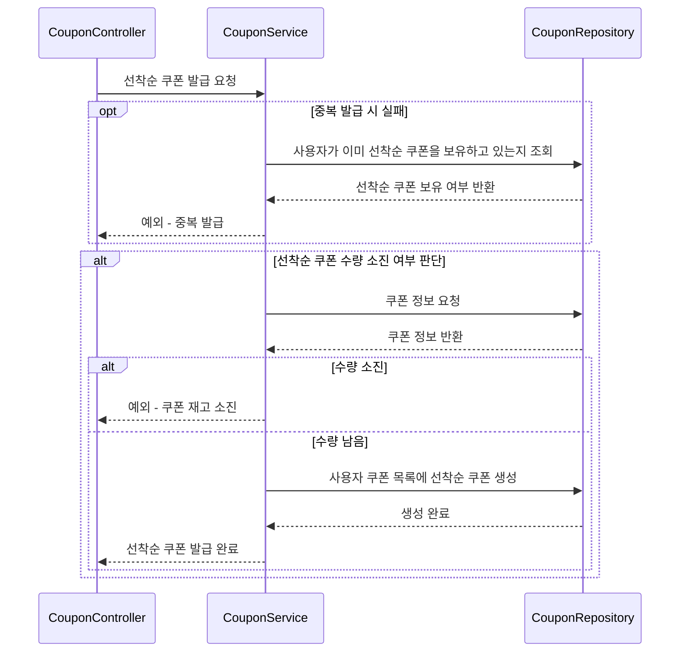

```mermaid
sequenceDiagram
        CouponController->> CouponService: 선착순 쿠폰 발급 요청
        opt 중복 발급 시 실패
            CouponService->>CouponRepository: 사용자가 이미 선착순 쿠폰을 보유하고 있는지 조회
            CouponRepository-->>CouponService: 선착순 쿠폰 보유 여부 반환
            CouponService -->> CouponController: 예외 - 중복 발급 
        end

        alt 선착순 쿠폰 수량 소진 여부 판단
            CouponService->>CouponRepository: 쿠폰 정보 요청
            CouponRepository-->>CouponService: 쿠폰 정보 반환
            alt 수량 소진
                CouponService-->>CouponController: 예외 - 쿠폰 재고 소진
            else 수량 남음
                CouponService->>CouponRepository: 사용자 쿠폰 목록에 선착순 쿠폰 생성
                CouponRepository-->>CouponService: 생성 완료
                CouponService-->>CouponController: 선착순 쿠폰 발급 완료
            end
        end
        
```