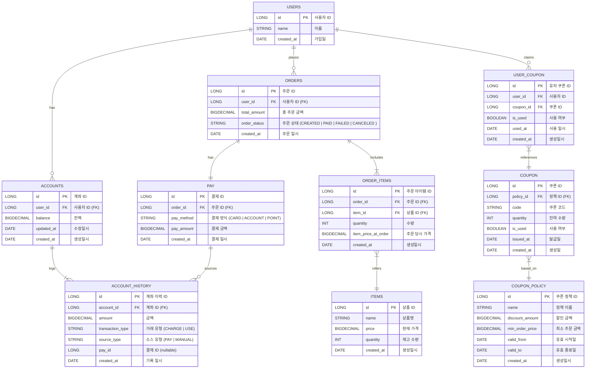

```mermaid
erDiagram
    USERS {
    LONG id PK "사용자 ID"
    STRING name "이름"
    DATE created_at "가입일"
    }

    ACCOUNTS {
        LONG id PK "계좌 ID"
        LONG user_id FK "사용자 ID (FK)"
        BIGDECIMAL balance "잔액"
        DATE updated_at "수정일시"
        DATE created_at "생성일시"
    }

    ACCOUNT_HISTORY {
        LONG id PK "계좌 이력 ID"
        LONG account_id FK "계좌 ID (FK)"
        BIGDECIMAL amount "금액"
        STRING transaction_type "거래 유형 (CHARGE | USE)"
        STRING source_type "소스 유형 (PAY | MANUAL)"
        LONG pay_id "결제 ID (nullable)"
        DATE created_at "기록 일시"
    }

    ORDERS {
        LONG id PK "주문 ID"
        LONG user_id FK "사용자 ID (FK)"
        BIGDECIMAL total_amount "총 주문 금액"
        STRING order_status "주문 상태 (CREATED | PAID | FAILED | CANCELED )"
        DATE created_at "주문 일시"
    }

    ORDER_ITEMS {
        LONG id PK "주문 아이템 ID"
        LONG order_id FK "주문 ID (FK)"
        LONG item_id FK "상품 ID (FK)"
        INT quantity "수량"
        BIGDECIMAL item_price_at_order "주문 당시 가격"
        DATE created_at "생성일시"
    }

    ITEMS {
        LONG id PK "상품 ID"
        STRING name "상품명"
        BIGDECIMAL price "현재 가격"
        INT quantity "재고 수량"
        DATE created_at "생성일시"
    }

    PAY {
        LONG id PK "결제 ID"
        LONG order_id FK "주문 ID (FK)"
        STRING pay_method "결제 방식 (CARD | ACCOUNT | POINT)"
        BIGDECIMAL pay_amount "결제 금액"
        DATE created_at "결제 일시"
    }

    COUPON_POLICY {
        LONG id PK "쿠폰 정책 ID"
        STRING name "정책 이름"
        BIGDECIMAL discount_amount "할인 금액"
        BIGDECIMAL min_order_price "최소 주문 금액"
        DATE valid_from "유효 시작일"
        DATE valid_to "유효 종료일"
        DATE created_at "생성일시"
    }

    COUPON {
        LONG id PK "쿠폰 ID"
        LONG policy_id FK "정책 ID (FK)"
        STRING code "쿠폰 코드"
        INT quantity "잔여 수량"
        BOOLEAN is_used "사용 여부"
        DATE issued_at "발급일"
        DATE created_at "생성일"
    }

    USER_COUPON {
        LONG id PK "유저 쿠폰 ID"
        LONG user_id FK "사용자 ID"
        LONG coupon_id FK "쿠폰 ID"
        BOOLEAN is_used "사용 여부"
        DATE used_at "사용 일시"
        DATE created_at "생성일시"
    }

    %% 관계 정의
    USERS ||--o{ ACCOUNTS : has
    ACCOUNTS ||--|{ ACCOUNT_HISTORY : logs
    USERS ||--o{ ORDERS : places
    ORDERS ||--|{ ORDER_ITEMS : includes
    ORDER_ITEMS }|--|| ITEMS : refers
    ORDERS ||--|| PAY : has
    PAY ||--o{ ACCOUNT_HISTORY : sources
    USERS ||--o{ USER_COUPON : claims
    USER_COUPON }|--|| COUPON : references
    COUPON }|--|| COUPON_POLICY : based_on
```