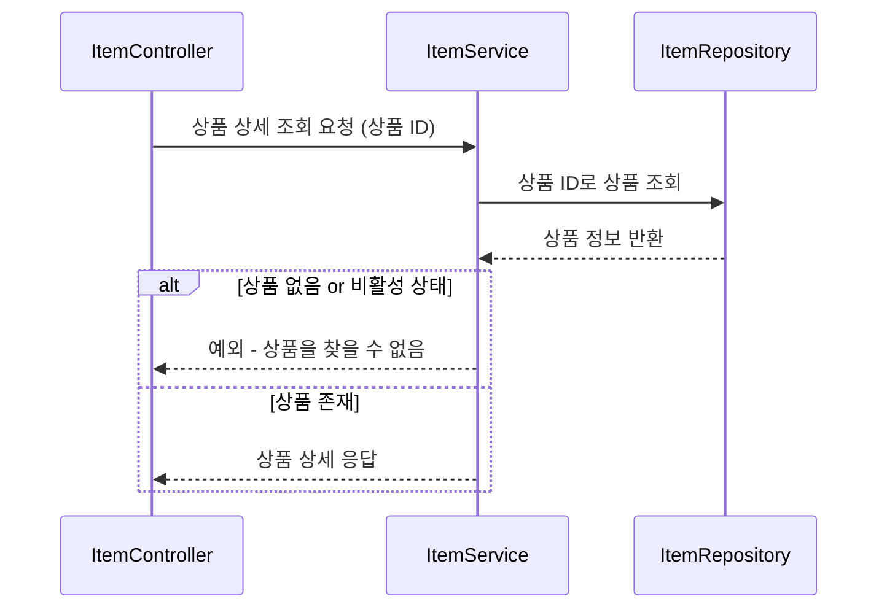

```mermaid
 sequenceDiagram
    participant ItemController
    participant ItemService
    participant ItemRepository

    ItemController ->> ItemService: 상품 상세 조회 요청 (상품 ID)
    ItemService ->> ItemRepository: 상품 ID로 상품 조회
    ItemRepository -->> ItemService: 상품 정보 반환

    alt 상품 없음 or 비활성 상태
        ItemService -->> ItemController: 예외 - 상품을 찾을 수 없음
    else 상품 존재
        ItemService -->> ItemController: 상품 상세 응답
    end

```