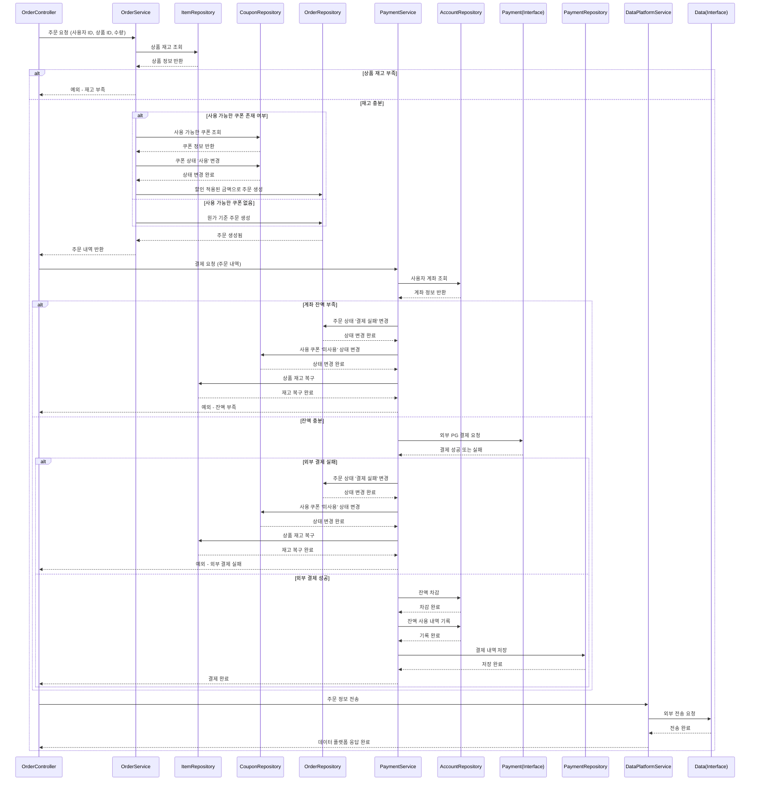

```mermaid
sequenceDiagram
participant OrderController
participant OrderService
participant ItemRepository
participant CouponRepository
participant OrderRepository
participant PaymentService
participant AccountRepository
participant Payment as Payment(Interface)
participant PaymentRepository
participant DataPlatformService
participant Data as Data(Interface)

OrderController ->> OrderService: 주문 요청 (사용자 ID, 상품 ID, 수량)
OrderService ->> ItemRepository: 상품 재고 조회
ItemRepository -->> OrderService: 상품 정보 반환

alt 상품 재고 부족
OrderService -->> OrderController: 예외 - 재고 부족
else 재고 충분

    alt 사용 가능한 쿠폰 존재 여부
      OrderService ->> CouponRepository: 사용 가능한 쿠폰 조회
      CouponRepository -->> OrderService: 쿠폰 정보 반환
      OrderService ->> CouponRepository: 쿠폰 상태 '사용' 변경
      CouponRepository -->> OrderService: 상태 변경 완료
      OrderService ->> OrderRepository: 할인 적용된 금액으로 주문 생성
    else 사용 가능한 쿠폰 없음
      OrderService ->> OrderRepository: 원가 기준 주문 생성
    end

    OrderRepository -->> OrderService: 주문 생성됨
    OrderService -->> OrderController: 주문 내역 반환

    OrderController ->> PaymentService: 결제 요청 (주문 내역)
    PaymentService ->> AccountRepository: 사용자 계좌 조회
    AccountRepository -->> PaymentService: 계좌 정보 반환

    alt 계좌 잔액 부족
      PaymentService ->> OrderRepository: 주문 상태 '결제 실패' 변경
      OrderRepository -->> PaymentService: 상태 변경 완료
      PaymentService ->> CouponRepository: 사용 쿠폰 '미사용' 상태 변경
      CouponRepository -->> PaymentService: 상태 변경 완료
      PaymentService ->> ItemRepository: 상품 재고 복구
      ItemRepository -->> PaymentService: 재고 복구 완료
      PaymentService -->> OrderController: 예외 - 잔액 부족
    else 잔액 충분
      PaymentService ->> Payment: 외부 PG 결제 요청
      Payment -->> PaymentService: 결제 성공 또는 실패

      alt 외부 결제 실패
        PaymentService ->> OrderRepository: 주문 상태 '결제 실패' 변경
        OrderRepository -->> PaymentService: 상태 변경 완료
        PaymentService ->> CouponRepository: 사용 쿠폰 '미사용' 상태 변경
        CouponRepository -->> PaymentService: 상태 변경 완료
        PaymentService ->> ItemRepository: 상품 재고 복구
        ItemRepository -->> PaymentService: 재고 복구 완료
        PaymentService -->> OrderController: 예외 - 외부 결제 실패
      else 외부 결제 성공
        PaymentService ->> AccountRepository: 잔액 차감
        AccountRepository -->> PaymentService: 차감 완료
        PaymentService ->> AccountRepository: 잔액 사용 내역 기록
        AccountRepository -->> PaymentService: 기록 완료
        PaymentService ->> PaymentRepository: 결제 내역 저장
        PaymentRepository -->> PaymentService: 저장 완료
        PaymentService -->> OrderController: 결제 완료
      end
    end

    OrderController ->> DataPlatformService: 주문 정보 전송
    DataPlatformService ->> Data: 외부 전송 요청
    Data -->> DataPlatformService: 전송 완료
    DataPlatformService -->> OrderController: 데이터 플랫폼 응답 완료

end
```