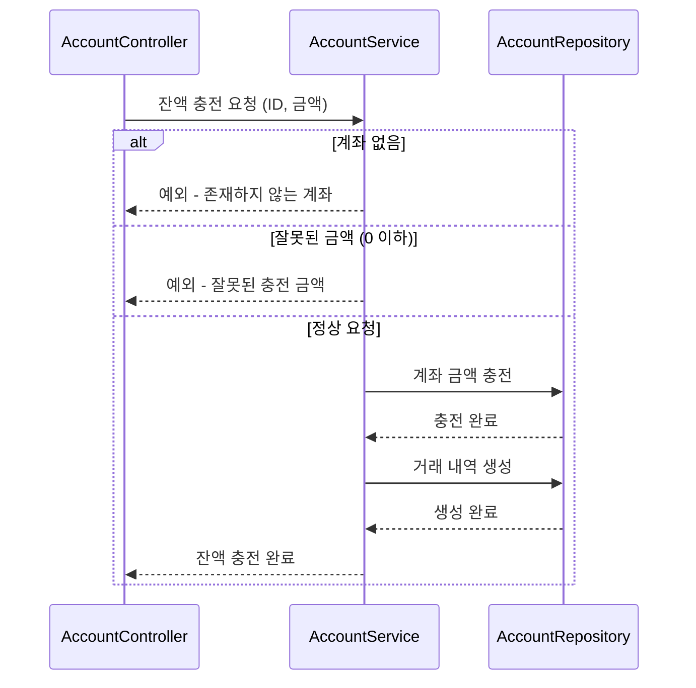

```mermaid
sequenceDiagram
    participant AccountController
    participant AccountService
    participant AccountRepository

    AccountController ->> AccountService: 잔액 충전 요청 (ID, 금액)

    alt 계좌 없음
        AccountService -->> AccountController: 예외 - 존재하지 않는 계좌
    else 잘못된 금액 (0 이하)
        AccountService -->> AccountController: 예외 - 잘못된 충전 금액
    else 정상 요청
        AccountService ->> AccountRepository: 계좌 금액 충전
        AccountRepository -->> AccountService: 충전 완료
        AccountService ->> AccountRepository: 거래 내역 생성
        AccountRepository -->> AccountService: 생성 완료
        AccountService -->> AccountController: 잔액 충전 완료
    end

   
```