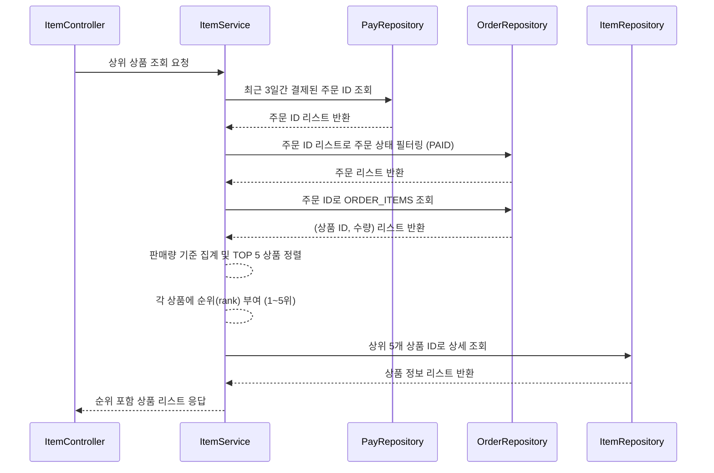

```mermaid
sequenceDiagram
    participant ItemController
    participant ItemService
    participant PayRepository
    participant OrderRepository
    participant ItemRepository

    ItemController ->> ItemService: 상위 상품 조회 요청

    ItemService ->> PayRepository: 최근 3일간 결제된 주문 ID 조회
    PayRepository -->> ItemService: 주문 ID 리스트 반환

    ItemService ->> OrderRepository: 주문 ID 리스트로 주문 상태 필터링 (PAID)
    OrderRepository -->> ItemService: 주문 리스트 반환

    ItemService ->> OrderRepository: 주문 ID로 ORDER_ITEMS 조회
    OrderRepository -->> ItemService: (상품 ID, 수량) 리스트 반환

    ItemService --> ItemService: 판매량 기준 집계 및 TOP 5 상품 정렬
    ItemService --> ItemService: 각 상품에 순위(rank) 부여 (1~5위)

    ItemService ->> ItemRepository: 상위 5개 상품 ID로 상세 조회
    ItemRepository -->> ItemService: 상품 정보 리스트 반환

    ItemService -->> ItemController: 순위 포함 상품 리스트 응답
```
